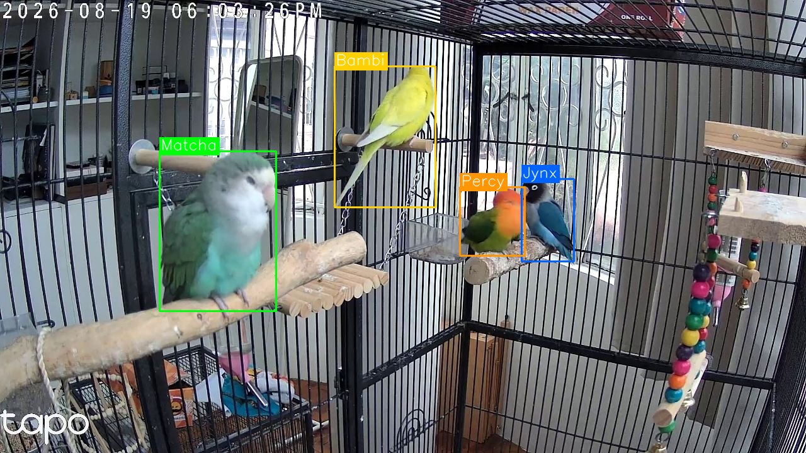
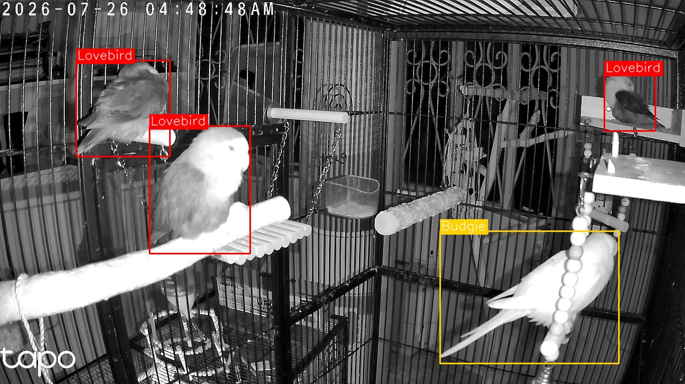
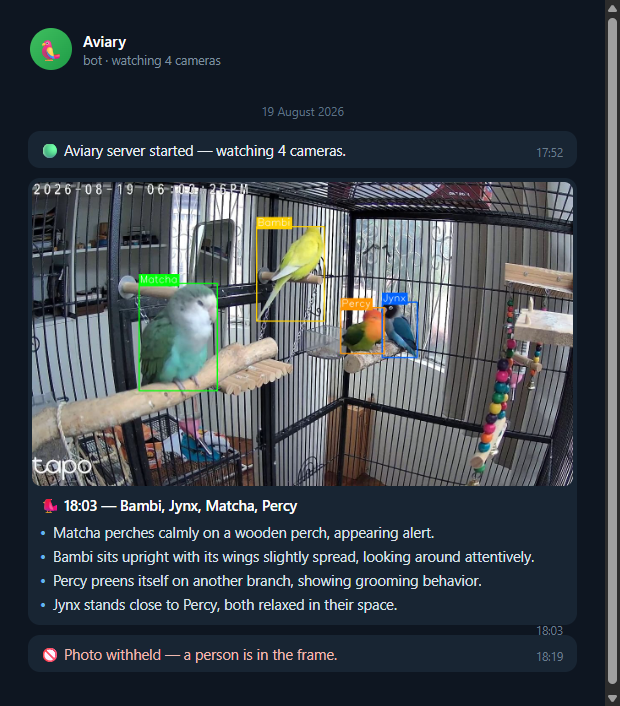
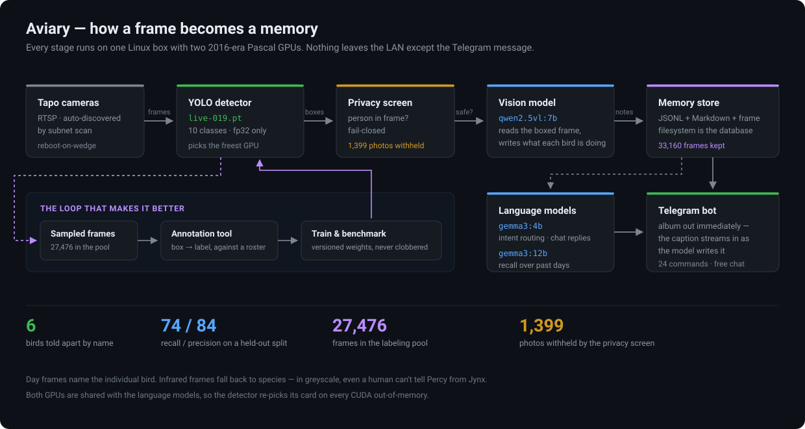
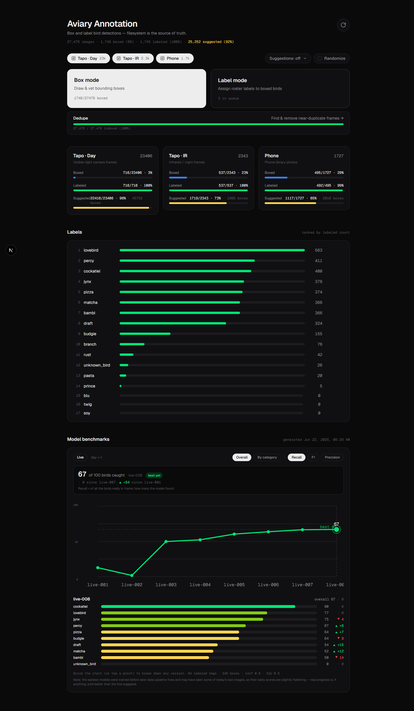
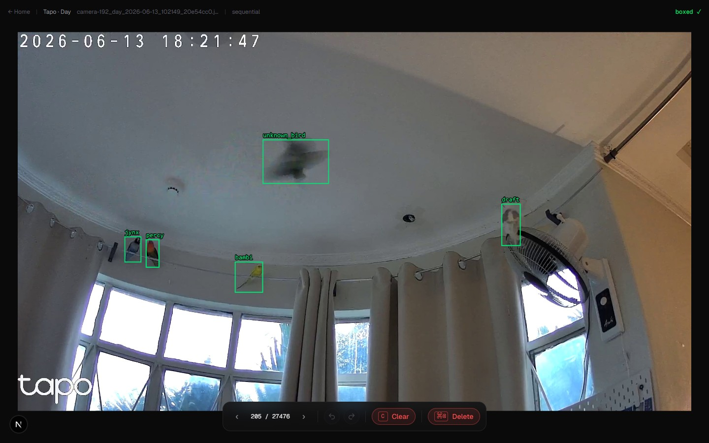
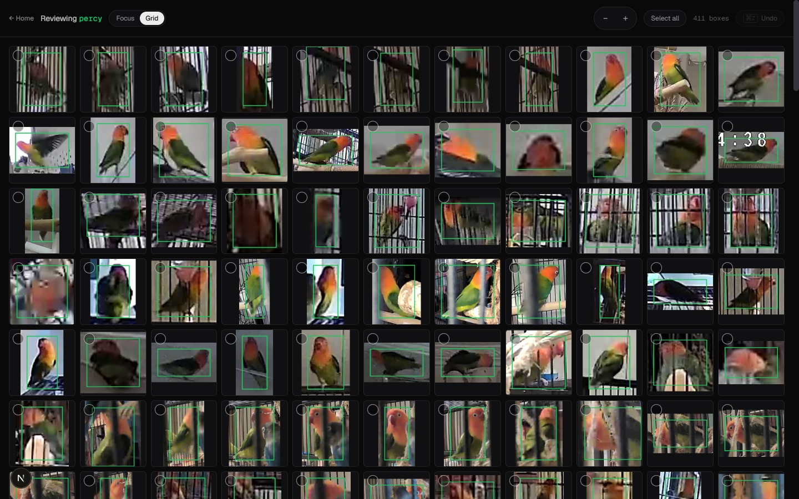
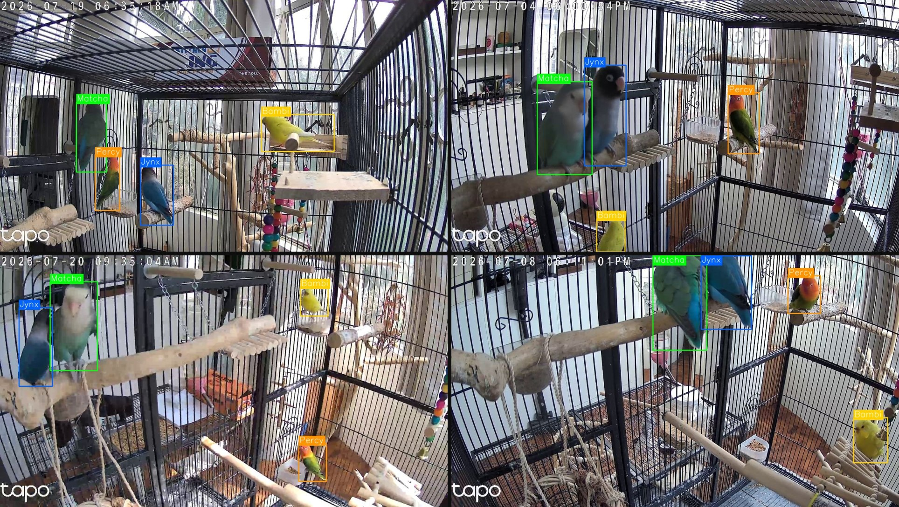

<h1 align="center">Aviary</h1>

<p align="center">
  <b>Six birds live in one room. This knows which is which, what each one is doing, and tells me about it.</b>
</p>

<p align="center">
  
</p>

<p align="center">
  <sub>A real frame from the running system. Not a demo — the server that produced this has been up for months.</sub>
</p>

---

Aviary watches a bird room through cheap Tapo cameras. A YOLO detector finds every
bird in every frame and says **which** bird it is — not "a bird", but *Percy*, by
name. A vision-language model then reads the labelled frame and writes down what
each one is doing. The result lands on my phone as a Telegram album, and is kept
as a searchable daily record I can ask questions about later.

All of it runs on one Linux box with **two GPUs from 2016**. Nothing leaves the
LAN except the Telegram message.

<table>
<tr>
<td align="center"><b>6</b><br><sub>birds told apart by name</sub></td>
<td align="center"><b>74% / 84%</b><br><sub>recall / precision, held-out split</sub></td>
<td align="center"><b>33,160</b><br><sub>frames kept as memories</sub></td>
<td align="center"><b>1,399</b><br><sub>photos withheld by the privacy screen</sub></td>
</tr>
</table>

---

## Telling six birds apart

Two cockatiels, three lovebirds, one budgie. Three of the lovebirds are the same
species and roughly the same size — the model separates them on plumage alone.

The detector runs **one class per individual**, not one class per species. That
is the whole difficulty of the project: `lovebird` is easy, `jynx` is not.

<p align="center">
  
</p>

**At night it deliberately stops guessing.** Tapo cameras switch to infrared
after dark, and in greyscale even a person who knows these birds can't tell
Percy from Jynx. So the roster encodes a rule: colour frames get the
individual's name, infrared frames fall back to `cockatiel` / `lovebird` /
`budgie`. Anything genuinely ambiguous becomes `unknown_bird` rather than a
confident lie.

That rule is enforced in one place — [`training/roster.yaml`](training/roster.yaml) —
which is simultaneously the label list for the annotation tool, the class map for
both trained models, and the documentation for why the split exists.

## What arrives on my phone

<p align="center">
  
</p>

The album is sent the instant the frame is processed, carrying just the header.
The written summary then **streams into that same caption** as the language model
generates it, via message edits — so the photo reaches me immediately instead of
waiting on inference that can take tens of seconds on a 2016 card.

The bot is not just a firehose. It takes 24 commands and free-form questions:
`/detections percy 2026-08-19`, `/sleep`, `/find matcha`, `/snapshot`,
`/weather`, or just asking it what the birds have been up to today.

**Every outbound photo is screened for people first.** The screen is
recall-biased and fail-closed — an image it can't decode counts as containing a
person — because a missed face is unrecoverable while a false positive merely
withholds one bird photo. In the current log window alone it has held back
1,399 photos.

## How it works

<p align="center">
  
</p>

Cameras are **found, not configured**: the server scans the subnet for hosts
serving a working RTSP stream, and an allowlist decides which of them it
consumes. Send it `/discover` and it re-scans at runtime.

## The labelling platform

A detector that identifies individuals needs a dataset that identifies
individuals, and nothing off the shelf does that. So the repo contains a full
annotation tool — a Next.js app where the **filesystem is the database**: it
reads images from disk and writes YOLO `.txt` labels back next to them. No
database, no auth, no export step.

<p align="center">
  
</p>

It tracks 27,476 images through two phases — **box**, then **label** — and
carries its own benchmark explorer, so every trained model's recall is visible
next to the data that produced it.

<table>
<tr>
<td width="50%">
  
  <sub><b>Box mode.</b> Free-flying birds, five boxes. The motion-blurred one is
  <code>unknown_bird</code> — the honest answer.</sub>
</td>
<td width="50%">
  
  <sub><b>Review grid.</b> All 411 boxes labelled <code>percy</code>, across day,
  infrared, cage and phone — the fastest way to catch a mislabel.</sub>
</td>
</tr>
</table>

It also ships a web app manifest, so it installs to an iPad home screen as a
standalone PWA — boxing birds on the couch beats doing it at a desk.

## Results

Deployed model `live-019`, scored on a **held-out test split** it never trained
on — 121 images, 313 boxes, confidence 0.4, IoU 0.5.

| | Recall | Precision | F1 |
|---|---:|---:|---:|
| **Overall** | **73.5%** | **83.9%** | **78.4%** |
| Day (colour, individual names) | 66.1% | 80.1% | 72.5% |
| Infrared (species only) | 83.9% | 88.6% | 86.2% |

The gap between those two rows *is* the project. Naming an individual in colour
is a materially harder problem than spotting a species in greyscale, and the
numbers say so.

<details>
<summary><b>Per-label breakdown</b></summary>

| Label | Recall | Precision | F1 | Ground truth |
|---|---:|---:|---:|---:|
| `cockatiel` (IR) | 87.5% | 97.2% | 92.1% | 40 |
| `lovebird` (IR) | 82.7% | 89.9% | 86.1% | 75 |
| `jynx` | 84.9% | 82.4% | 83.6% | 33 |
| `bambi` | 74.4% | 90.6% | 81.7% | 39 |
| `percy` | 64.1% | 86.2% | 73.5% | 39 |
| `budgie` (IR) | 80.0% | 66.7% | 72.7% | 15 |
| `pizza` | 56.2% | 75.0% | 64.3% | 16 |
| `draft` | 55.6% | 71.4% | 62.5% | 18 |
| `matcha` | 57.1% | 66.7% | 61.5% | 35 |
| `unknown_bird` | 0.0% | — | — | 3 |

Species labels outscore individuals, which is the expected shape: telling a
lovebird from a budgie is a far easier problem than telling Jynx from Matcha.
The two cockatiels (`draft`, `pizza`) are the weakest pair and are the current
data-collection priority.

`unknown_bird` scores zero on three ground-truth boxes — it is a deliberate
catch-all for birds a human annotator couldn't identify either, and there is
nowhere near enough of it to learn from. It is listed here rather than quietly
dropped.

</details>

Training runs write **versioned weights** — `live-001.pt` through `live-019.pt` —
so a new run can never clobber the model the server has loaded.

## Choosing the language models

The three model roles were not picked by vibes. There is a reproducible eval
suite (`uv run llm-eval --all`) scoring 8 tasks across 3 roles against explicit
pass thresholds, and a 10-candidate search was run against the incumbents.

| Role | Model | Why it survived |
|---|---|---|
| Vision | `qwen2.5vl:7b` | double the next-best score on observation decoration; smaller models describe the *annotation overlay* instead of the bird |
| Chat / intent | `gemma3:4b` | every sub-4B model passed intent parsing but failed grounding — inventing sightings, ignoring paused state |
| Recall | `gemma3:12b` | a hard accuracy cliff below 12B: confabulated clock times, dropped yes/no polarity |

Full write-up, including the known flaws still being tracked, is in
[`MODEL_EVAL_REPORT.md`](MODEL_EVAL_REPORT.md).

## The constraints that shaped it

The hardware is a GTX 1060 6GB and a GTX 1050 Ti 4GB — both Pascal, both from
2016 — and they are **shared with the language models**. Several design
decisions fall directly out of that:

- **`torch` is pinned to 2.7.1 / cu118.** It is the last release shipping Pascal
  (sm_61) kernels; newer cu12x builds ship cuDNN 9, which refuses SM < 7.5 and
  crashes every inference.
- **Half precision is banned.** Pascal runs fp16 at roughly 1/64 of fp32
  throughput, so AMP would make things dramatically *slower*.
- **The detector re-picks its GPU on every CUDA OOM**, because the vision model
  next to it may have just taken the VRAM it wanted.
- **Camera frames are downscaled before upload.** A 2304×1296 frame times out on
  a home uplink, and a timed-out alert is a silently dropped alert.

## More from the cameras

<p align="center">
  
</p>

<sub>Different cages, different light, different distances — all four birds
identified in each.</sub>

## Repository layout

| Path | What lives there |
|---|---|
| `server/` | camera capture, detection, VLM, memory, Telegram bot (~24k lines) |
| `annotation/` | the Next.js labelling tool |
| `training/` | dataset prep, training, evaluation, and `roster.yaml` |
| `docs/` | design notes and images |

## Running it

Setup, environment variables, every `uv run` command and the full operational
guide live in **[docs/DEVELOPMENT.md](docs/DEVELOPMENT.md)**.

The short version:

```bash
uv sync                # installs every subsystem plus the cu118 torch build
cp .env.example .env   # add TAPO_CREDENTIALS and a Telegram bot token
uv run annotation      # the labelling tool, on :5000
uv run server          # camera inference + alerts
```
